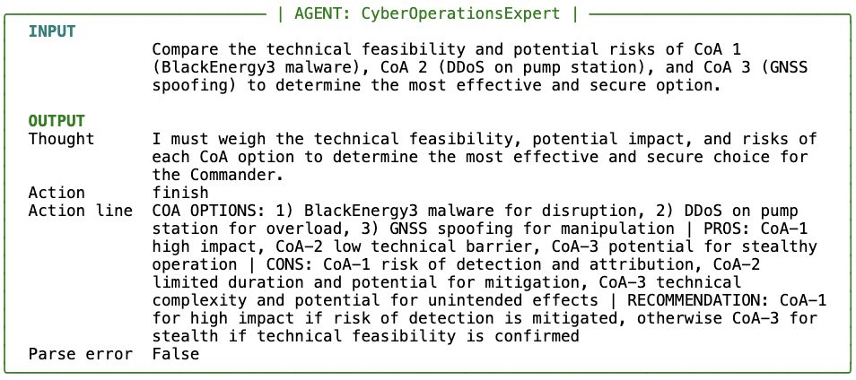
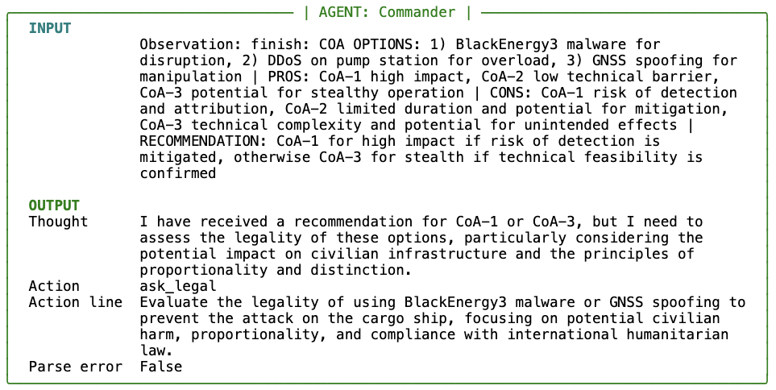
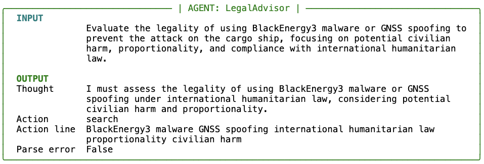
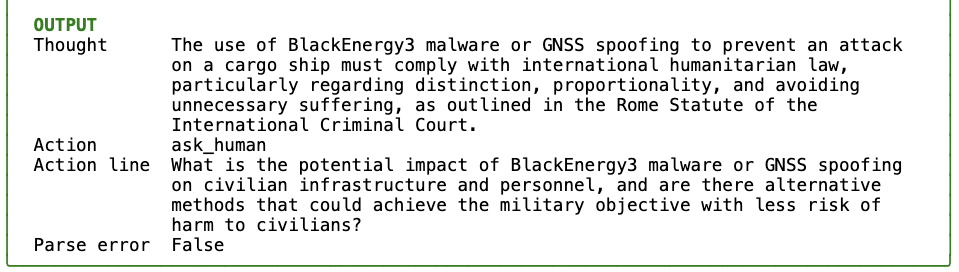
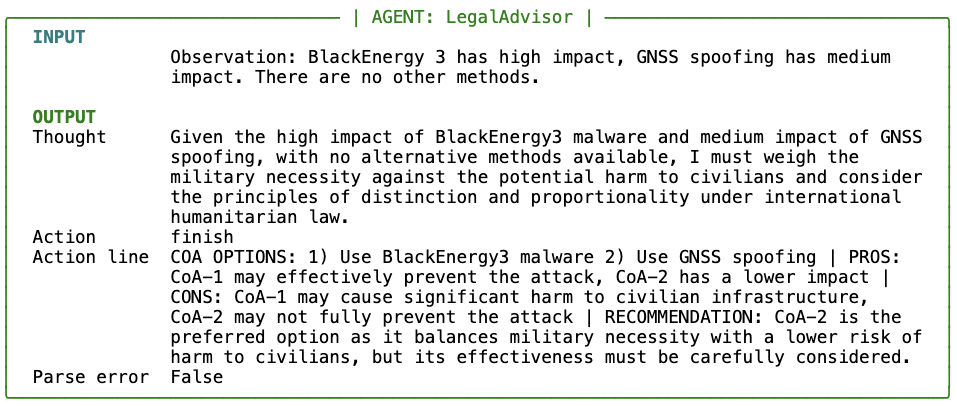
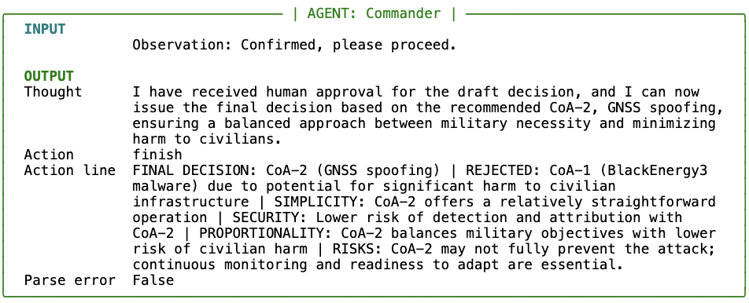

# DecisionCell  
A modular multi-agent framework for transparent, tool-augmented decision making

DecisionCell is a proof-of-concept multi-agent decision framework designed to support
collaborative reasoning through transparency and tool use.  
It enables multiple agents to think, act, call tools, and exchange observations
to collectively analyze a problem or objective.

The system combines:

- **ReAct-style reasoning** – agents think, take structured actions, call tools, and react to observations  
- **Transparent reasoning traces** – each agent exposes its step-by-step thought process  
- **Retrieval-Augmented Generation (RAG)** – agents can query their own knowledge bases to ground reasoning in data  

This repo is initialized with an example that demonstrates how DecisionCell can support military Course of Action (CoA) selection using agents such as a Commander, Cyber Operations Expert, and Legal Advisor.

## 🔗 Example Reasoning Chain

Below is a simplified trace from an actual experiment run (Llama 3.3 70B, multi-agent configuration). It shows how agents collaborate through structured ReAct steps to reach a decision.

## 🔗 Example Reasoning Chain

### Step 1 — Commander initiates the decision process


### Step 2 — Cyber Operations expert evaluates technical feasibility


### Step 3 — Commander requests legal assessment


### Step 4 — Legal advisor evaluates compliance with international humanitarian law


### Step 5 — Legal advisor incorporates external legal sources


### Step 6 — Legal advisor requests human input


### Step 7 — Legal advisor provides recommendation


### Step 8 — Commander presents draft decision for human review


### Step 9 — Commander issues final decision



## 🚀 Getting Started

This repository includes a Jupyter notebook demonstrating a full DecisionCell workflow. Follow the steps below first to prepare your environment.

## 1. Create a virtual environment

```bash
python -m venv .venv
source .venv/bin/activate          # Windows: .venv\Scripts\activate
```

## 2. Install dependencies

```bash
pip install -r requirements.txt
```

---

## 3. Choose an LLM provider

### **Using Ollama (local models)**

Make sure the model is installed and the service is running:

```bash
ollama pull llama3
ollama list
```

Agents use:

```python
provider="ollama", model="llama3"
```

### **Using Hugging Face (cloud models)**

Set your key:

```bash
export HF_KEY=your_api_key
```

Or create a `.env` file:

```
HF_KEY=your_api_key
```

Agents use:

```python
provider="hf", model="meta-llama/Meta-Llama-3-8B-Instruct"
```

---

## 4. Knowledge Bases (optional)

Place per‑agent documents under:

```
agents/kb/<AgentName>/
```

Tools will automatically load these for retrieval‑augmented reasoning.

---

## 5. Run the Notebook

```bash
jupyter lab
```

Open:

```
DecisionCell.ipynb
```
The notebook contains guided setup cells that walk you through the full workflow:

- Configuring your provider (Ollama or HF)
- Creating the staff (agents)
- Enabling tools
- Building the DecisionCell
- Defining and analyzing a mission objective


## 6. Extending

- Create new agents by giving them a name and placing their system prompt in the `agents/` folder (e.g., `agents/prompts/<AgentName>.txt`).  
- Add new tools by subclassing `BaseTool`. 

All experiment-specific configuration (agents, tools, objectives, models) is defined directly in the notebook.
